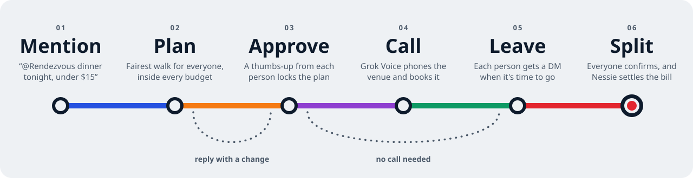
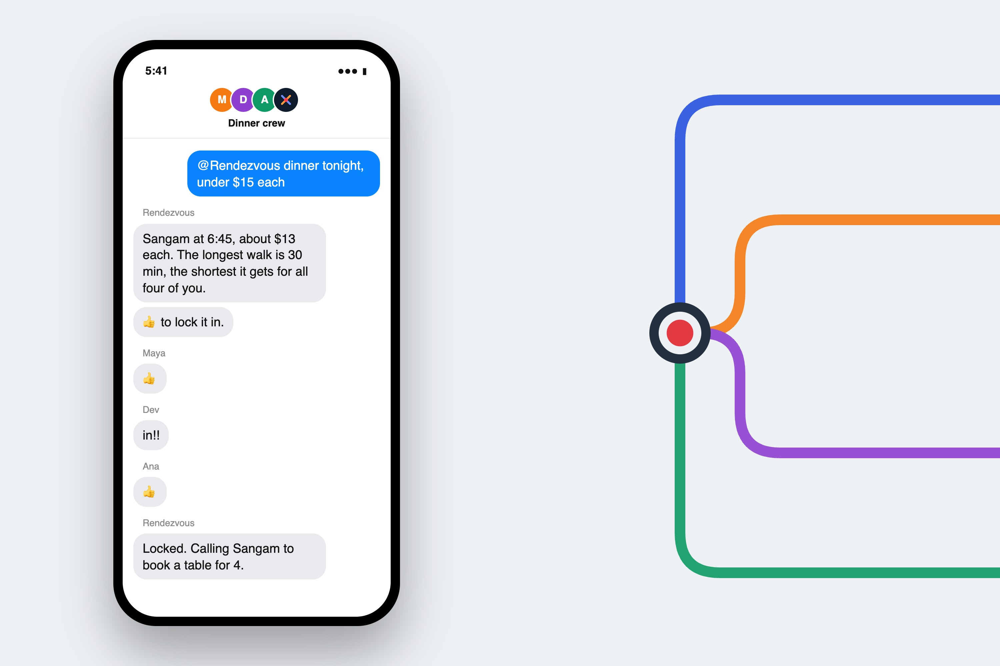
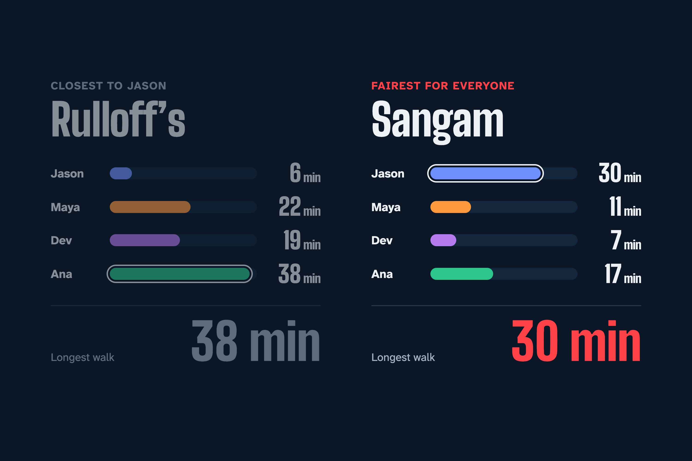
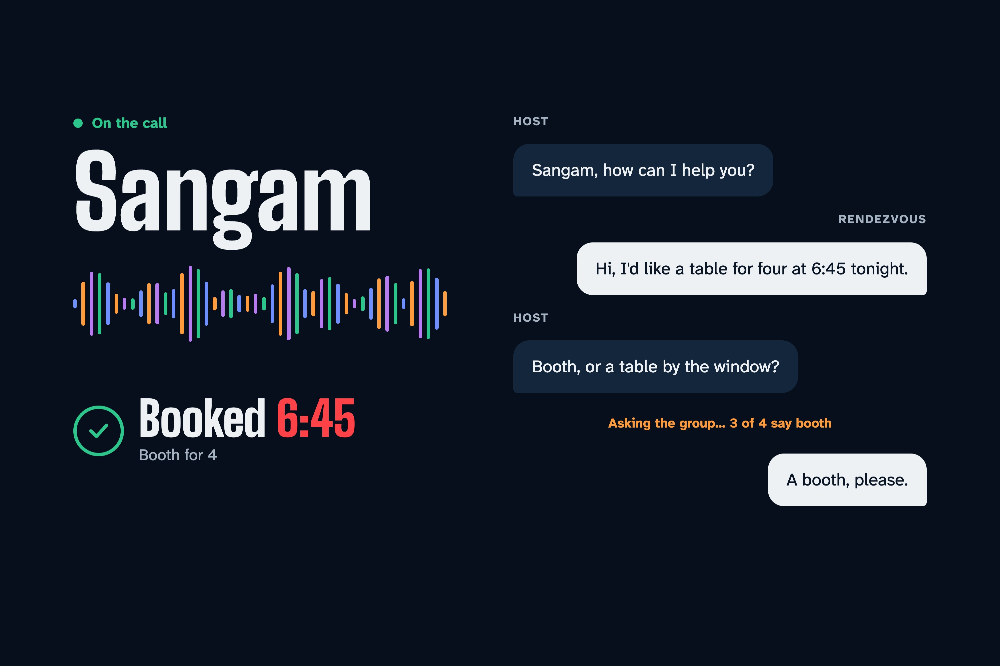
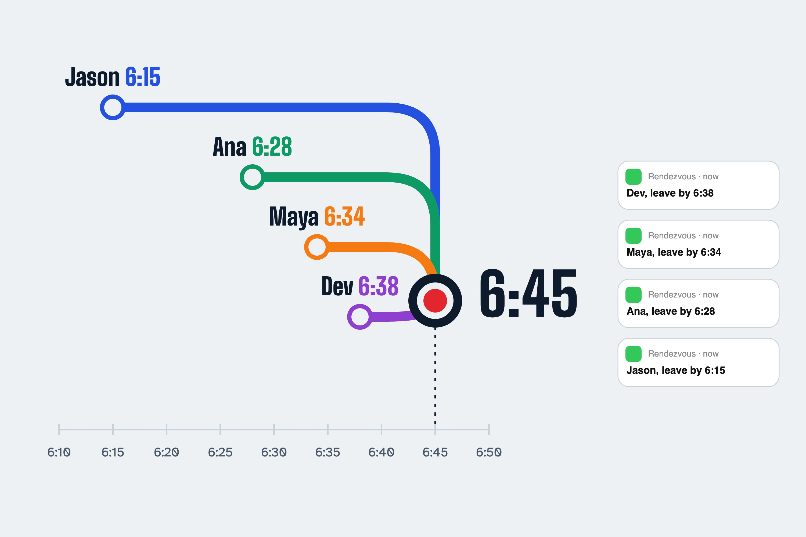
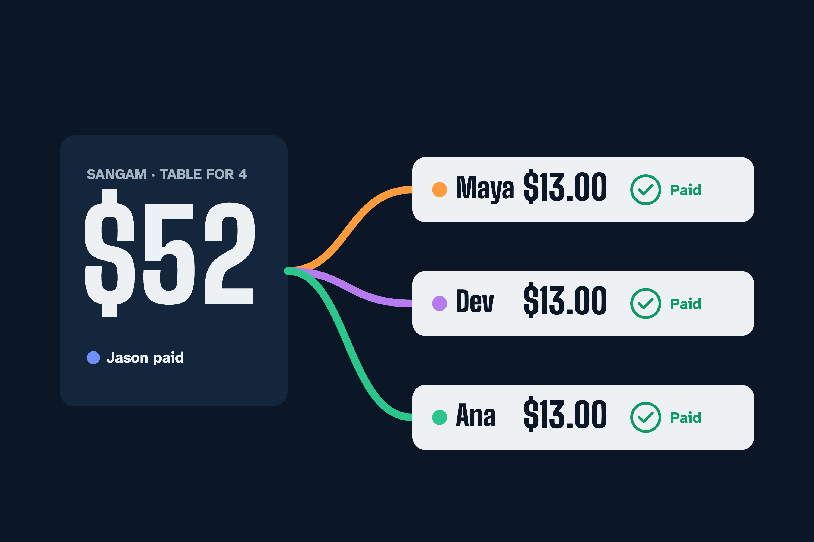
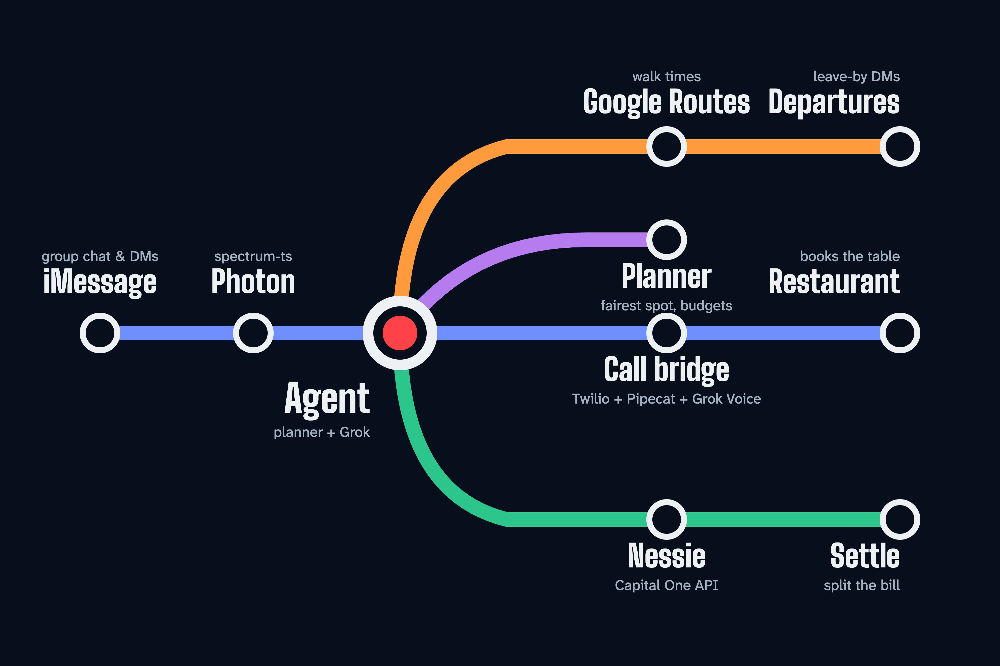

<a href="https://tablefor.us">
  <picture>
    <source media="(prefers-color-scheme: dark)" srcset=".github/readme/header-dark.svg">
    
  </picture>
</a>

<p align="center">
  <b>An iMessage agent that gets a friend group to the same place at the same time.</b><br>
  Mention it in a group chat. It picks the fairest spot, calls to book the table,<br>
  tells each person when to leave, and splits the bill afterward.
</p>

<p align="center">
  <a href="https://tablefor.us"><b>tablefor.us</b></a>
  &nbsp;·&nbsp;
  <a href="demo/rendezvous-promo.mp4">Watch the promo</a>
  &nbsp;·&nbsp;
  <a href="SPEC.md">Read the spec</a>
  &nbsp;·&nbsp;
  <a href="#quick-start">Run it locally</a>
</p>

<p align="center">
  <sub>Built at BigRed//Hacks 2026 on Photon, Grok, Capital One Nessie and Google Routes</sub>
</p>

<br>

## How it works

One mention runs the whole loop. The group only steps in to approve, answer the venue's questions and confirm payments.

<picture>
  <source media="(prefers-color-scheme: dark)" srcset=".github/readme/route-dark.svg">
  
</picture>

<table>
  <tr>
    <td width="50%" valign="top">
      
      <p><b>It lives in the group chat.</b> Say <code>@Rendezvous dinner tonight, under $15 each</code>. It proposes a place and a time, and a thumbs-up from everyone locks it in. Reply with a change and it re-plans.</p>
    </td>
    <td width="50%" valign="top">
      
      <p><b>Fair, not closest.</b> The planner picks the venue that minimizes the <i>longest</i> walk in the group, within every budget and every free slot. Nobody gets stuck with the long walk.</p>
    </td>
  </tr>
  <tr>
    <td width="50%" valign="top">
      
      <p><b>It makes the call.</b> Grok Voice phones the restaurant through Twilio. If the host asks something the agent doesn't know, it asks the group mid-call and relays the answer.</p>
    </td>
    <td width="50%" valign="top">
      
      <p><b>Everyone leaves at their own time.</b> Each person gets a DM before they need to go, timed by their own walk, with a Maps link that opens to the route.</p>
    </td>
  </tr>
  <tr>
    <td width="50%" valign="top">
      
      <p><b>The bill settles itself.</b> Post what you paid. Each person confirms their share with a tapback, and that moves the money through Capital One Nessie.</p>
    </td>
    <td width="50%" valign="top">
      
      <p><b>One engine, many lines.</b> The planner and conversation engine are shared by the agent, the terminal simulator and the live demo on the site.</p>
    </td>
  </tr>
</table>

## What's inside

| | |
| --- | --- |
| [`packages/core`](packages/core) | Planner, parsers, message copy and the conversation engine, shared by everything below |
| [`apps/agent`](apps/agent) | Agent server on Photon (spectrum-ts) and Grok, plus Nessie, Google and the bridge endpoints |
| [`apps/bridge`](apps/bridge) | Python call bridge: Twilio, Pipecat and Grok Voice ([setup](apps/bridge/README.md)) |
| [`apps/web`](apps/web) | Landing page for [tablefor.us](https://tablefor.us), with a live demo running the real engine in the browser |

## Quick start

```bash
npm install
npm test            # core planner + engine tests
npm run dev:web     # landing page on http://localhost:5173
npm run sim         # the whole loop in your terminal, no keys needed
```

In the simulator, type `name: message` to talk as someone, `👍 maya` or `👍 all` to tap back, and `/go` to send departure DMs now.

## Running the real agent

1. `cp apps/agent/.env.example apps/agent/.env` and fill in what you have. Everything except Photon has an offline fallback.
2. `cp apps/agent/data/members.example.json apps/agent/data/members.json` with your team's handles, names and usual spots.
3. `npm run seed` seeds the Ithaca venues as Nessie merchants. `npm run seed -- --members` also creates a customer and checking account for each member.
4. Start the bridge ([`apps/bridge/README.md`](apps/bridge/README.md)) and expose it with ngrok for Twilio.
5. `npm run dev:agent`, add the Photon number to a group chat and say `@Rendezvous dinner tonight, under $15 each`.

To exercise the agent and bridge together without Twilio, run the bridge, then `SIM_BRIDGE=1 npm run sim`. The bridge's simulate mode plays the host and asks the group real questions through `ask_group`.

<details>
<summary><b>Things to check before the demo</b></summary>
<br>

- **Plans run over 1:1 texts on a Free/Pro Photon line.** A shared-pool line can't carry group chats, and each person texts their own assigned number. The organizer texts the agent something like `@Rendezvous dinner tonight under $15 with Sandy 561-555-0100`. The agent registers new invitees with Photon's users API, texts each of them, and relays everyone's messages. A 👍 in any thread counts, and STOP leaves the plan. Each organizer gets their own address book in `apps/agent/data/contacts.json`. Names with numbers are saved automatically, and you can manage it with `save Sandy 561-555-0100`, `save group Roommates: Sandy, Maya`, `save this group as Roommates`, `contacts`, `groups` and `forget Sandy`. On a Business dedicated line, real iMessage group chats work as well.
- **Venue coordinates in `packages/core/src/venues.ts` are approximate.** Check them in Google Maps. Phone numbers are blank on purpose, and every call goes to `DEMO_HOST_PHONE`.
- **Nessie (checked Oct 3):** only `https://api.nessieisreal.com` works; plain http is reset. Merchant `category` is a string. Transfers take no payee, amounts are stored as whole dollars, and balances don't move. The agent writes a transfer on the debtor's account and a deposit on the payer's, with the exact amount and payee in the description. For judges: the money moves in Nessie's records, and the exact cents live in the agent's split.
- **The Routes API ignores arrival time for walking**, so the agent subtracts the walk from the reservation time itself.

</details>

## Renaming

The product name lives in `apps/web/src/brand.ts` (site) and `AGENT_NAME` (agent). The README art is generated by `python3 .github/readme/build.py`, which reads its names, places and colors from the top of that file.
