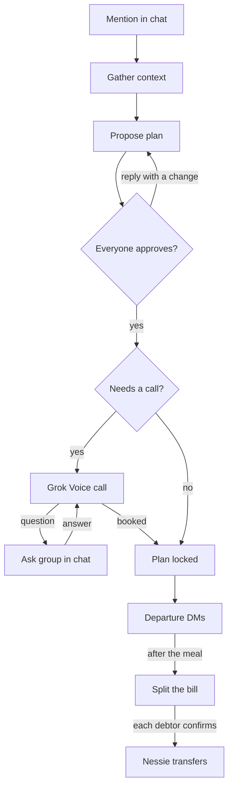
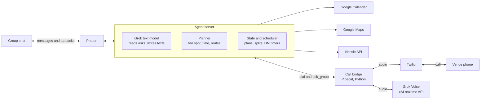

# Rendezvous Spec

Oct 3, 2026 · Jason Pitchford

## Overview

Rendezvous is an iMessage agent that lives in a group chat and gets a friend group to the same place at the same time. It runs on [Photon](https://photon.codes/), a platform for building AI agents that send and receive iMessages. Someone mentions it by name, and it checks calendars, locations and budgets, proposes a restaurant and time, calls to book the table when needed, DMs each person directions before they need to leave, and settles the bill afterward.

The project answers the BigRed//Hacks 2026 Navigation theme through its prompt about navigation that connects people to each other and their communities. Each person travels a different route, and Rendezvous coordinates all of them toward one destination and one arrival time.

The target user is a college friend group or club spread across campus, for example four Cornell students on North Campus, in Collegetown and on the Engineering Quad who want dinner tonight for under $15 each.

Submission closes on Devpost at 8:30 AM Sunday, October 4, and judging starts at 9:00 AM.

## Prize tracks

Rendezvous targets six tracks with integrations that each do a job the product needs, and Photon carries the most value. Prizes come from the [Devpost page](https://bigredhacks2026.devpost.com/).

| Track | Prize | Role in Rendezvous |
| --- | --- | --- |
| [Photon](https://photon.codes/) | $400 cash, $300 credits and a fast track to Photon's final interview round (runner-up gets $200 cash and $100 credits) | The entire interface, including group chat, tapback approvals and DMs |
| Capital One Nessie | $250 cash | Venue directory (seeded Ithaca restaurants as merchants), budget filter from account balances, and P2P transfers for the bill split |
| SpaceX | Cursor mechanical keyboard per member | Grok Voice places the reservation call, the Grok text model runs the agent, and the team builds everything in Cursor |
| BigRed Main | MLH winner pins | Theme fit through group navigation |
| GoDaddy Registry | Digital gift card | tablefor.us for the landing page, a .us domain hack that reads "table for us" |
| Software, Design, People's Choice | Not listed | Opt in, since entry costs nothing |

Grok Imagine event invites are optional polish. ElevenLabs stays as the fallback for the venue call if the Grok Voice bridge fails by 2 AM.

## User flow

A single mention runs the whole loop, and the group only steps in to approve, answer the venue's questions and confirm payments.



A reply with a change sends the plan back for a new proposal, and the venue call can pause to ask the group before it books.

## Features

Rendezvous has seven features, and the first six form the core demo loop.

### 1. Invocation and context

A member mentions Rendezvous in the group chat with a goal, for example "@Rendezvous dinner tonight, under $15 each." The Grok text model parses the request into a structured plan request with activity, date window, budget per person, party size and any stated locations.

The agent then gathers context for every member.

- Calendar free/busy from Google Calendar, never event titles
- Location from shared location, or from what the member said in chat ("I'm at Duffield")
- Nessie account balance, used only to filter out venues a member can't afford
- Candidate venues from Nessie merchants, which the team seeds with real Ithaca restaurants, coordinates, phone numbers, price levels and a booking method

### 2. Planning

The planner picks the venue that minimizes the longest travel time in the group, which keeps the meeting point fair. It considers only venues within everyone's budget and time slots where every member is free.

The earliest valid slot starts after now plus the longest travel time plus a 15-minute buffer. Walking times come from the Google Maps Directions API. The planner keeps the top three options and proposes the best one, with the other two held as backups.

The proposal message lists the venue, time, price range and each person's travel time, and asks everyone to react with a thumbs up.

### 3. Approval loop

The plan locks when every member reacts with a thumbs up. A text reply such as "too far, somewhere in Collegetown" or "can we do 8 instead" triggers a re-plan with that constraint added, and the agent posts a new proposal.

If some members stay silent, the agent posts "Locking this in 10 minutes unless someone objects" and proceeds after the timeout. After three rounds of counter-proposals, the member who invoked the agent picks the final plan.

### 4. Venue call with Grok Voice

When the chosen venue's booking method is phone, the agent places an outbound call through Twilio and bridges the audio to the Grok Voice Agent API. The agent identifies itself as an AI assistant booking for the group.

Before dialing, the agent already holds the reservation name, callback number, party size, time and any seating or accessibility needs, so mid-call questions stay rare. The voice agent has three tools.

| Tool | Arguments | Behavior |
| --- | --- | --- |
| ask_group | question, options | Posts the question to the group chat, waits up to 60 seconds for the first reply, and returns the answer to the call |
| report_result | status, time, notes | Posts the booking outcome to the group chat |
| end_call | reason | Hangs up and closes the Twilio call |

While ask_group waits, the voice agent fills the silence every 15 seconds ("Still checking with my party, thanks for your patience"). With no answer after 60 seconds, it takes a safe default if one exists, or tells the host it will call back and asks the group in chat.

Preferences such as time or seating take the first reply. Anything binding, such as a cancellation fee, needs the organizer's reply. Multiple-choice questions use numbered replies (1, 2, 3), and yes/no questions accept a tapback.

### 5. Departure DMs

Each member gets a DM 15 minutes before they need to leave. The send time equals the reservation time minus that member's travel time minus 15 minutes, using the Directions API with arrival time set to the reservation.

The DM contains the venue, time and a Google Maps link in this format, which opens with the route ready and starts from the member's live location.

```
https://www.google.com/maps/dir/?api=1&destination=LAT,LNG&travelmode=walking
```

If Photon can't open a 1:1 thread with a group member, the agent @mentions that member in the group instead.

### 6. Bill split

After the meal, a member posts what they paid, for example "I paid $52." The agent splits it equally by default and accepts adjustments such as "Maya had an extra drink, add $5 to hers."

The agent posts one message per person who owes money, for example "Maya owes Jason $17.33." Each debtor confirms by reacting with a thumbs up to their own message, and only that person's reaction triggers the Nessie P2P transfer from their account to the payer's. The agent then replies "Maya → Jason $17.33 ✓".

### 7. Event invites (optional)

For events with more than eight people, the agent generates an invite image with Grok Imagine and posts it with the plan details. This feature is the first cut if time runs short.

## Architecture

One agent server owns all state and talks to the group through Photon, and a separate call bridge handles the phone audio.



The agent server's language follows Photon's SDK, and the call bridge runs as its own Python service on Pipecat with Grok Voice. Twilio reaches the bridge through an ngrok URL, and SQLite or in-memory state is enough for the demo. The landing page is a static site on tablefor.us, with pullup.club as the fallback if it's taken.

### Data model

| Entity | Fields |
| --- | --- |
| Group | chat id, members, organizer |
| Member | iMessage handle, name, Nessie account id, calendar id, last known location |
| Venue | Nessie merchant id, name, coordinates, phone, price level, booking method (phone or walk-in) |
| Plan | group, venue, time, status (proposed, approved, booking, locked), round, two backup options |
| Call | plan, Twilio call id, status, questions asked, result |
| Split | plan, payer, total, one line per debtor with amount, confirmed flag and Nessie transfer id |

## Rules and edge cases

The agent never moves money or commits the group without the right person's consent, and it shares the minimum data each step needs.

| Situation | Behavior |
| --- | --- |
| A member never reacts to a proposal | Agent posts a 10-minute warning, then locks the plan |
| Three rounds of counter-proposals | Organizer picks the final plan |
| Venue has no availability | Agent asks the group about alternate times (ask_group), else moves to the next backup venue |
| Host asks something the agent doesn't know | ask_group with a 60-second cap, then a safe default or a callback |
| Host asks for a card to hold the table | Agent declines and offers to pay on arrival, or ends the call and tells the group |
| Call fails or nobody answers | Agent posts in chat and offers the next backup venue |
| Member shares no location | Agent uses what they said in chat, or asks once after approval |
| Member has no linked calendar | Agent treats them as free and flags it in the proposal |
| Someone reacts to another person's split line | Agent ignores it, since only the debtor's reaction counts |
| Debtor's Nessie balance is too low | Agent posts the failure and skips that transfer |

Privacy rules for the build and the pitch follow.

- Calendars expose free/busy only, never event names or attendees.
- Locations feed travel-time math only and never appear in the group chat.
- Balances filter venues only, and the chat never shows anyone's balance.
- The voice agent states that it is an AI assistant at the start of every call.
- The agent never speaks or stores card or account numbers.

## Build plan

The team freezes features at 4 AM and submits by 7:30 AM, an hour before the deadline.

### Team split

| Person | Owns |
| --- | --- |
| A | Photon agent loop, tapback handling, Grok text brain, approval loop |
| B | Nessie seeding, balances and transfers, planning algorithm, Google Calendar and Maps |
| C | Twilio and Grok Voice call bridge, ask_group tool, departure DM scheduler |
| D | GoDaddy landing page, Devpost write-up, deck PDF on Google Drive, demo script, Cursor screenshots |

### Milestones

1. First hour. Verify Photon exposes tapbacks and 1:1 DMs, provision a Twilio number, get xAI, Nessie and Google keys, and seed 10 to 15 Ithaca restaurants as Nessie merchants.
2. Midnight. Text-only core loop works end to end, from mention to proposal to approval to split.
3. 2 AM. Grok Voice call books a table with a teammate playing the host, including one ask_group round trip. If not, switch the call to ElevenLabs and add Grok Imagine invites to keep SpaceX eligibility.
4. 4 AM. Feature freeze, with departure DMs and the landing page live.
5. 4 AM to 7 AM. Polish, rehearse the demo three times, write the Devpost entry and export the deck.
6. 7:30 AM. Submit on Devpost.

### Cut order

1. Grok Imagine invites
2. Calendar checks (hardcode availability)
3. Departure DMs (send immediately on demo trigger instead of scheduling)

The core loop of mention, plan, approval, venue call and split never gets cut.

### Risks

| Risk | Check | Fallback |
| --- | --- | --- |
| Photon doesn't expose tapbacks | First hour | Numbered or "yes" replies for approval |
| Call bridge eats too much time | 2 AM checkpoint | ElevenLabs outbound call |
| 60-second ask_group wait drops the Twilio stream or Grok session | Test early with a teammate | Shorten the cap to 30 seconds, then callback |
| Twilio trial can only dial verified numbers | First hour | Verify teammates' numbers, which the demo uses anyway |
| Venue Wi-Fi or ngrok fails during judging | Night before | Hotspot and a recorded backup video |

## Demo and pitch

The preliminary round gives each team 2 minutes to present and 2 minutes of Q&A, so the demo runs live on the team's phones with one rehearsed happy path.

### Setup

- Four teammates sit in a real iMessage group with Rendezvous added.
- One teammate's phone plays the restaurant host, verified in Twilio, on speaker.
- The demo reservation sits a few minutes out, or a hidden fast-forward command triggers the departure DMs.
- A laptop shows the landing page on the GoDaddy domain.

### Script

| Time | Beat |
| --- | --- |
| 0:00 to 0:20 | Problem. "Six texts, three 'where are you,' and one friend who never pays you back." |
| 0:20 to 0:40 | Mention Rendezvous and show the proposal arrive with everyone's travel time |
| 0:40 to 0:55 | Three thumbs up, one counter-proposal, and the re-plan |
| 0:55 to 1:25 | The venue call on speaker, with the host asking a question, everyone's phone buzzing, a teammate replying "1," and the call continuing |
| 1:25 to 1:40 | Departure DMs land on each phone with a Maps link |
| 1:40 to 1:55 | "I paid $52," each debtor taps a thumbs up, and Nessie transfers confirm |
| 1:55 to 2:00 | Close by naming Photon, Nessie, Grok Voice, Cursor and GoDaddy and each one's job |

### Likely judge questions

- **Who authorizes payments?** Only the person who owes taps to confirm their own transfer.
- **Is the restaurant real?** The demo host is a teammate, and the call path is the same Twilio dial a real venue would receive.
- **Why Nessie data?** Nessie is a sandbox, so the team seeded real Ithaca restaurants as merchants with real coordinates.
- **What about privacy?** Free/busy only, locations never posted, and the agent announces itself as an AI on calls.
- **How is this navigation?** It routes several people from different places to one place and one arrival time, each on their own path.
